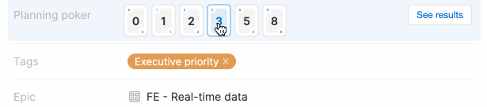

# Planning poker

This [Aha! Develop](https://www.aha.io/develop/overview) extension enables teams
to play planning poker for estimating the effort on records in Aha!. Estimates
can be entered by multiple users simultaneously. You only see the estimates 
from your team mates after entering your own estimate.

It provides these contributions:

* Planning poker attribute - Add the planning poker attribute to a custom
  layout for Epics, Features or Requirements.

## Demo



## Installing the extension

**Note: In order to install an extension into your Aha! Develop account, you must be an account administrator.**

Install the planning poker extension by clicking [here](https://secure.aha.io/settings/account/extensions/install?url=https%3A%2F%2Fsecure.aha.io%2Fextensions%2Faha-develop.planning-poker.gz).

## Working on the extension

Install `aha-cli`:

```sh
 npm install -g @aha-app/aha-cli
```

Clone the repo:

```sh
git clone https://github.com/aha-develop/planning-poker.git
```

**Note: In order to install an extension into your Aha! Develop account, you must be an account administrator.**

Install the extension into Aha! and set up a watcher:

```sh
aha extension:install
aha extension:watch
```

Now, any change you make inside your working copy will automatically take effect in your Aha! account.

When you are finished working on your extension, build it so that others can install it through its URL:

```sh
aha extension:build
```

To learn more about developing Aha! Develop extensions, including the API reference, the full documentation is located here: [Aha! Develop Extension API]()
